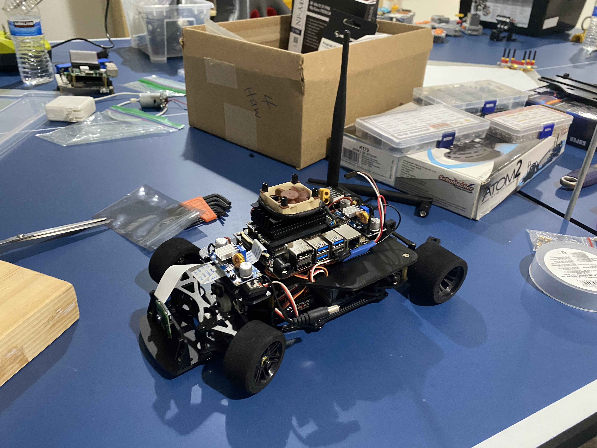

# July 2022
SPARK USEL Future Engineers Engineering Notebooks

***

# 7/2/22
We attempted to get the Jetson to boot off of a USB drive, as the built-in EMMC doesn't have enough capacity to install the Jetpack SDK. The large 78-tooth diff gear was installed as well.

### Updates
* Successfully changed the boot manager to boot from USB
* 78-tooth diff gear installed

There were issues installing it, as before in mid-June we attempted to do this as well. There were initial issues using NVIDIA's SDK Management tool, as it couldn't find any compatible versions of JetPack for Ubuntu 20.

# 7/4/22
We set up Tensorflow and began working on making a test dataset and making GPIO PWM work.

### Updates
* Following guide to setting up and using TensorFlow.
* The 128GB card was flashed, so we now have a lot more storage available.
* Did some testing to try and get GPIO pins working and also making TensorFlow work.

We used the [guide](http://www.yahboom.net/study/jetson-NANO) supplied by Yahboom to set up our environment. We only needed steps 1.3 and the first 1.4, which for whatever reason step 1.4 came before step 1.3, and there was a second step 1.4 after step 1.3. Afterwards we went through section 3, with minimal issues. It completed the test program with flying colors, so we moved on to trying to create a training data set using the camera. We ended with the camera able to capture an image, though unencoded and therefore uncompressed.

Meanwhile, work was being done to test the GPIO. We plan to use the [jetson-gpio](https://github.com/NVIDIA/jetson-gpio) library to control the pins. It installed fine, but we were unable to actually control any of the pins. We eventually found that the BCM and BOARD pinouts were slightly different, and we were able to turn on and off LEDs with the GPIO. Whether the PWM pins work or not is to be found, but we will need to find the correct pinout for this carrier board or we will not even be able to find the pins.

Below are links to the video.

[Link to video (download)](./July/7-4-22-a.mp4)  
[Link to video (download 2)](https://raw.githubusercontent.com/definitely-nobody-is-here/SPARK_Future-Engineers_2022/master/Notebook/2022/July/7-4-22-a.mp4)

# 7/9/22
Some changes and additions.

### Updates
* Jetson NANO has issues booting
* Improvements to platform
* Addition of a WIFI/Bluetooth card

On 7/7/22 we discovered that the Jetson NANO wouldn't boot anymore. Once plugged in it would give the error `****NvRmMemInit failed****` and refused to boot. Today we plan on flashing a second NANO and using that instead, returning the original one.

In other news, a refresh for the platform is to be done, with changes to improve wire management and the addition of an LED display to monitor voltage and a WIFI/Bluetooth card and antennas. We will have to start shaving weight if we keep adding more things, however. We're approaching the limit at 1.4kg. The WIFI and Bluetooth antennas won't be used in competition since they serve no use, so they must be easily removable. We started by testing the coaxial connector attachement points, which were modeled specifically for our connectors.

# 7/10/22
We encountered the meminit error again after changing out the NANO and platform.

### Updates
* Rebuilt top platform with new NANO and platform
* WiFi added
* PWM works

##### New platform

##### PWM

We managed to use PWM. Initially the io config program (jetson-io.py) would crash every time, so we weren't able to enable PWM. After a lot of editing and changing files that should not be changed, we managed to enter the menu for GPIO configuration. The issue was caused by the board reporting a slightly different version than the library supported, being a revision of the board and therefore technically not supported. It reported as p3448-0000-b00+p3449-0002-b00 while the closest supported board was p3448-0000-b00+p3449-0000-b00. This is because our Developer Kit is the slightly updated version of that board. We were able to bypass the files by copying and renaming a .dtb file in `/boot/dtb` and then hardcoding some parameters in `/opt/nvidia/Utils/dtb.py`. And after that, we were able to enable PWM.

The PWM works, as shown in the video below of the PWM changing the effective voltage being read by the multimeter.

[Link to video (download)](./July/7-10-22-c.mp4)
[Link to video (download 2)](https://raw.githubusercontent.com/definitely-nobody-is-here/SPARK_Future-Engineers_2022/master/Notebook/2022/July/7-10-22-c.mp4)

As can be seen in the video linked below (twice) the PWM works to control both the servo and ESC, but with no accuraccy.

[Link to video (download)](./July/7-10-22-b.mp4)
[Link to video (download 2)](https://raw.githubusercontent.com/definitely-nobody-is-here/SPARK_Future-Engineers_2022/master/Notebook/2022/July/7-10-22-b.mp4)

A major issue is that if done wrong, the motor will actually draw so much current that the voltage drops low enough to make the NANO shut down. Of course we will electronically limit the current draw of the motor so this doesn't happen, and it's not like we will go that fast anyways.

A slightly less major issue is the issue of calibration. The servo and ESC have an acceptable range of pulse width, and so we must change the min and max duty cycles to be able to control them.